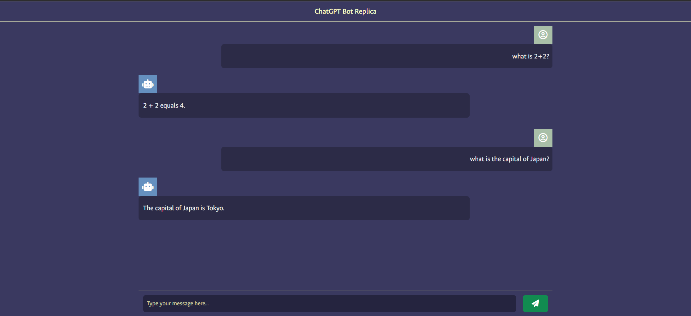

# ChatGPT Angular Bot Replica

A conversational AI chatbot web application built with [Angular](https://angular.dev/) and styled with [Tailwind CSS](https://tailwindcss.com/). This project replicates the ChatGPT interface and experience, providing a modern, responsive UI and seamless chat interactions.



## Features

- 🧠 ChatGPT-like conversational UI
- ⚡ Fast, responsive, and mobile-friendly design
- 🎨 Custom styling with Tailwind CSS and Google Fonts
- 🌐 Server-side rendering (SSR) support
- 🧪 Unit testing with Karma and Jasmine

## Getting Started

### Prerequisites

- [Node.js](https://nodejs.org/) (v18 or higher recommended)
- [Angular CLI](https://angular.dev/tools/cli) (`npm install -g @angular/cli`)

### Installation

Clone the repository and install dependencies:

```sh
git clone https://github.com/your-username/chatgpt-angular.git
cd chatgpt-angular/chatgpt-angular
npm install